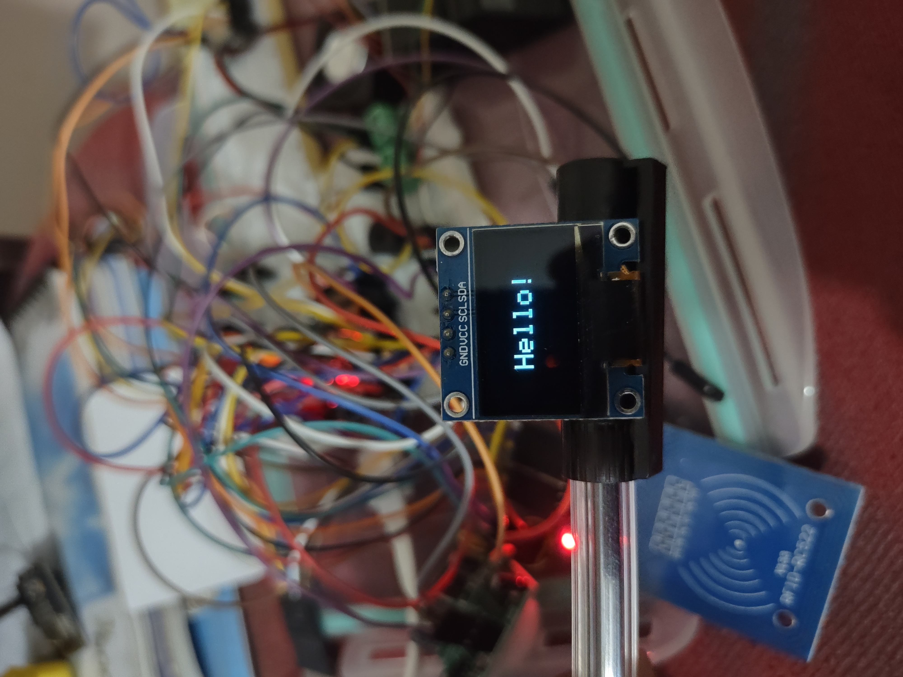

# ESP32 OLED Hello World Display

Simple example to display "Hello" on an SSD1306 OLED display using ESP32.

## Purchase Links
- [0.96" I2C OLED Display (SSD1306)](https://www.amazon.com/dp/B072Q2X2LL)
- [ESP32 Development Board](https://www.amazon.com/dp/B08D5ZD528)

## Pin Configuration

| OLED Display | ESP32 Pin |
|--------------|-----------|
| VCC          | 3.3V      |
| GND          | GND       |
| SCL          | GPIO 22   |
| SDA          | GPIO 21   |

## Dependencies
- Adafruit SSD1306 Library
- Adafruit GFX Library

## Installation
1. Clone this repository
2. Open in Arduino IDE or PlatformIO
3. Install required libraries
4. Upload to ESP32

## Example Output

## Test Code
See [examples/HelloWorld/HelloWorld.ino](examples/HelloWorld/HelloWorld.ino)

## License
MIT License - See [LICENSE](LICENSE) for details
